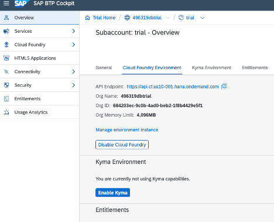
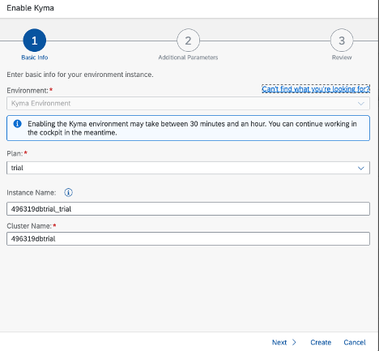
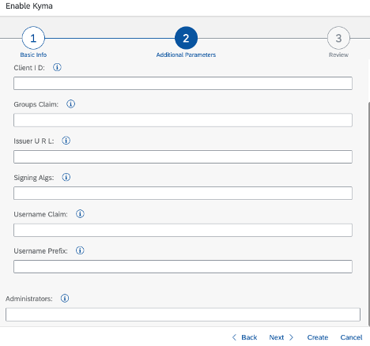
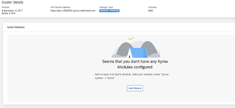
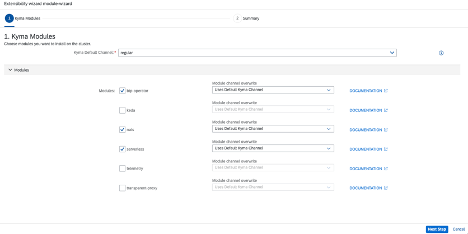
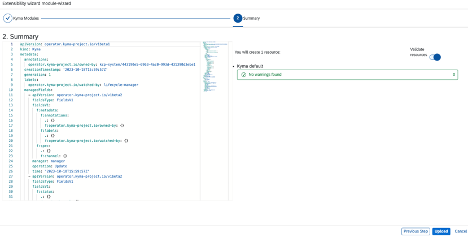
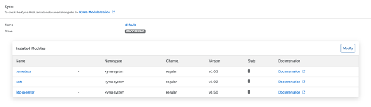

# SKR-Learning-Journey

Exercise steps for the SAP Learning Journey - [Deliver Side-by-Side Extensibility based on SAP BTP, Kyma Runtime](https://learning.sap.com/learning-journey/deliver-side-by-side-extensibility-based-on-sap-btp-kyma-runtime)

- [Unit 1 - Discovering Kubernetes](./Unit-1/README.md)
- [Unit 2 - Discovering Kyma](./Unit-2/README.md)
- [Unit 3 - Working with Kubernetes Workloads](./Unit-3/README.md)
- [Unit 4 - Using Services to Create Internal and External Communication with Kubernetes](./Unit-4/README.md)

- [Unit 6 - Using Kyma Eventing](./Unit-6/README.md)
- [Unit 7 - Using Kubernetes Storage and StatefulSets](./Unit-7/README.md)
- [Unit 8 - Performing Observability and Monitoring](./Unit-8/README.md)
- [Unit 9 - Using SAP BTP Service Management](./Unit-9/README.md)
- [Unit 10 - Using ConfigMaps and Secrets](./Unit-10/README.md)
- [Unit 11 - Working with Helm Charts - Unofficial Extra Unit](./Unit-11/readme.md)

## Provisioning

> Refer to the [help documentation](https://help.sap.com/docs/btp/sap-business-technology-platform/getting-started-in-kyma-environment) for further information.

- Within the BTP Cockpit under the menu option **Overview**, choose the option **Enable Kyma**. This requires that the subaccount has been entitled for Kyma Runtime.

- Choose **Next**

- This dialog allows a custom IDP supporting Open ID Connect to be configured if desired. Additional Administrators can also be provided. Let the default option and choose **Create**

## Modules

To complete the exercies enable the modules as shown

- Open the Kyma console and choose the menu option **Cluster Details**
- Within the **Kyma Modules** pane, choose the option to Add Module

- Choose the following Modules and then choose **Next Step**
  - btp-operator
  - nats
  - serverless
  - application-connector

- Choose **Upload**

- Enabling the modules may take a few minutes to complete. Once completed the **Installed Modules** should display as

