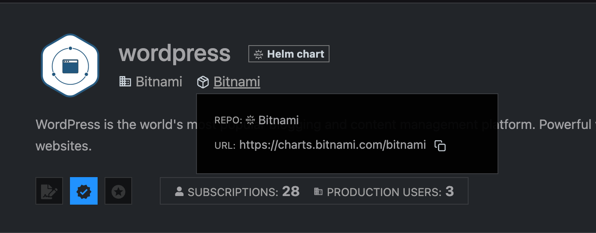

# Working with Helm Charts

## Prerequsites

In order to work with helm you need a proper configuration of kubectl and an installation of helm cli.
Check [helm.sh](https://helm.sh/docs/intro/install/) for OS details.
On Mac you can use brew:

```bash
brew install helm
```

## Helm Chart Hub

You can find many Helm Charts on [artifacthub.io](artifact.io). In this example we will install a Wordpress blog.

## Excercise

### Add a Helm Repository

First step is to add a reference to an external Helm Chart repository.
Each chart is published via a content provide, which provides the charts via an own repository. You need do add the URL of this repository to your own environment.

On the artifacthub you can find the URL in each chart here:



First check which repositories you already have configured:

```bash
helm repo ls
```

You will probably see a warning telling you that the kubeconfig is world and group readable. You can ignore them for now.

We will install a bitnami repo, which is provided by VMWare.
You can find the details here:
[Wordpress Chart](https://artifacthub.io/packages/helm/bitnami/wordpress)

We will add the bitnami repo to our helm config by

```bash
helm repo add bitnami https://charts.bitnami.com/bitnami
```

You can also seach available helm charts via helm cli:

```bash
helm search repo wordpress
```

### Installing Helm Charts

We are already setup to install charts. Anyhow, many charts need to be configured initially before installation. Helm offers a convenient way doing this.

Each chart provides a list of configuration parameters called "Default Values", which can be found on the charts webpage.

These Default Values are simple key-value pairs in yaml format.
Luckily, you don't need to provide all config parameters as many have reasonable defaults.

Anyhow, please be aware that even some of the parameters MUST be provided during initial installation and cannot be changed later!

An example file is provided here [./values-wordpress.yaml](values-wordpress.yaml).

The way to provide your own values is pretty simple. You provide a list of config parameters via a local yaml file overwriting the default values of the helm chart at deployment time.

So let's create a local config file:

wordpress-values.yaml

```yaml
wordpressUsername: mynadmin
wordpressPassword: "Initial123!"
wordpressBlogName: Kyma Wordpress Blog
```

Now let's install wordpress using our configuration.

```bash
helm install wordpress bitnami/wordpress --values=wordpres-values.yaml
```

After some time, you can see that all pods and other artifacts are running:

```bash
kubectl get all
```

You can know access your freshly deployed app via the deployed service in your browser. Please not that you may need to configure TLS on your cluster to enable secure browser connections.

### Rolling out new version

As mentioned, not all config values can be changed after initial deployement, but some are. It's safe to assume that resource request can be adopted anytime, so let's change them.

Add the following values to your wordpress-values.yaml:

```yaml
wordpressUsername: mynadmin
wordpressPassword: "Initial123!"
wordpressBlogName: Kyma Wordpress Blog
# new values
resources:
  limits: {}
  requests:
    memory: 1Gi
    cpu: 300m
```

Initial memory was 512Mi, which seemed a bit low, so we doubled it.

Apply the changes using:

```bash

```
